# Porsche 911 Showcase Website

This project is a collection of dedicated web pages highlighting some of the most iconic and special Porsche 911 models.

## Featured Models

- **[Porsche 911 Targa](targa.html)** – Explore the classic Targa design with its signature removable roof panel.  
- **[Porsche 911 Spirit of ’70](spirit70.html)** – A special edition celebrating Porsche’s racing heritage and 70 years of automotive excellence.  
- **[Porsche 911 Turbo 50 Years](turbo50.html)** – Commemorating 50 years of Turbo innovation, combining performance with iconic styling.

Each model has its own dedicated page with detailed information, images, and specifications.

### Main Hub Page (`webpage.html`)

The page serves as the central landing page of the website. It provides:

- An overview of the Porsche 911 line  
- Links and navigation buttons to each special model page  
- High-quality hero images of all featured models  
- A simple, desktop-focused layout for easy browsing  

## Features
- Central hub page for easy navigation  
- Separate pages for each special Porsche 911 model  
- High-quality images and detailed descriptions

# Preview
## Main hub (`webpage.html`)
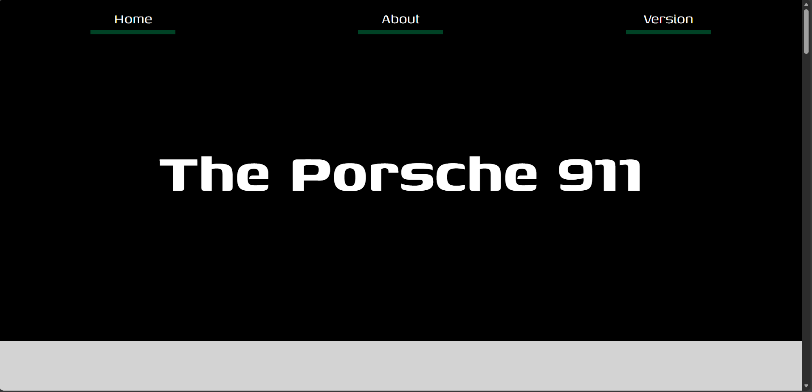

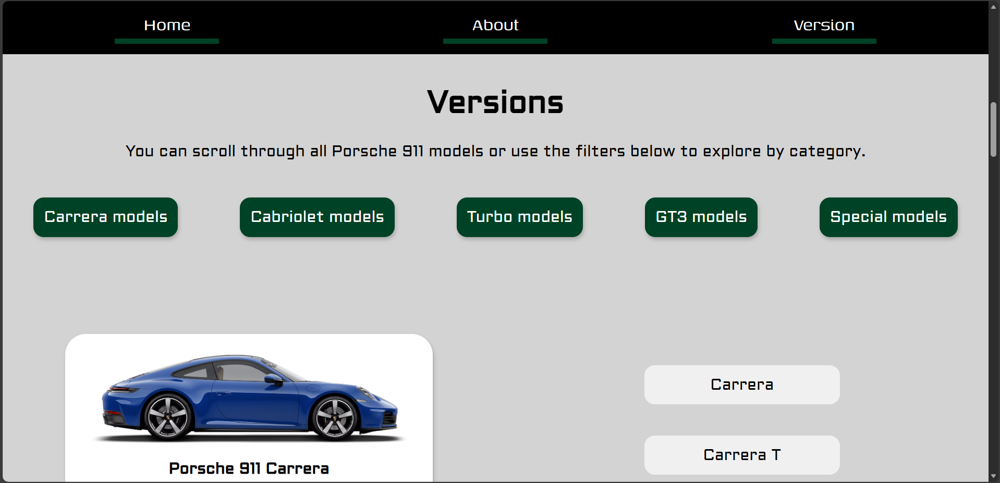

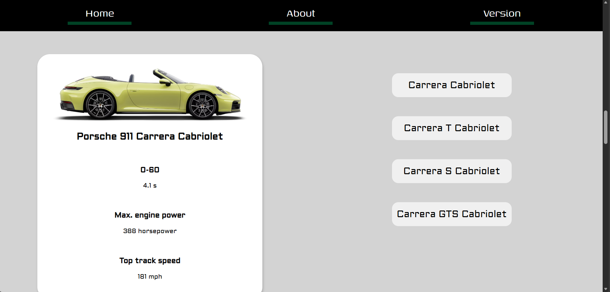

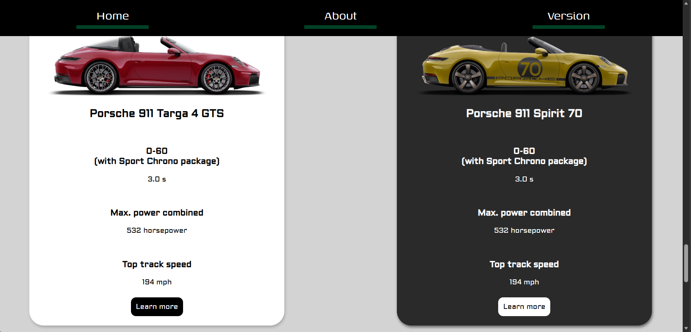

  

## Porsche 911 Targa 4 GTS (`targa.html`)
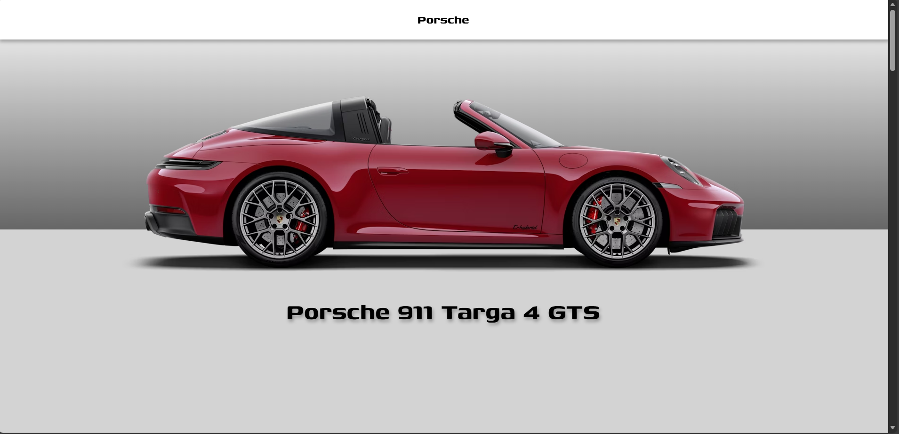

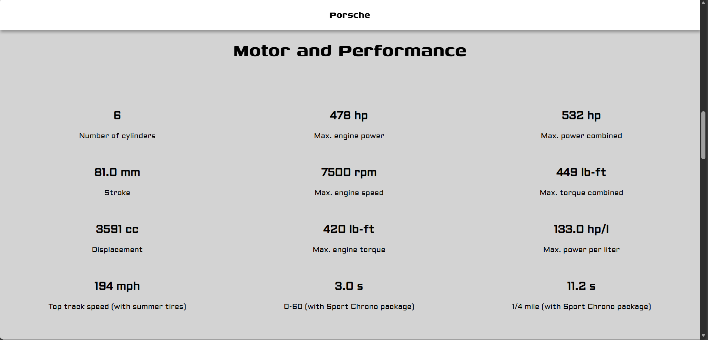

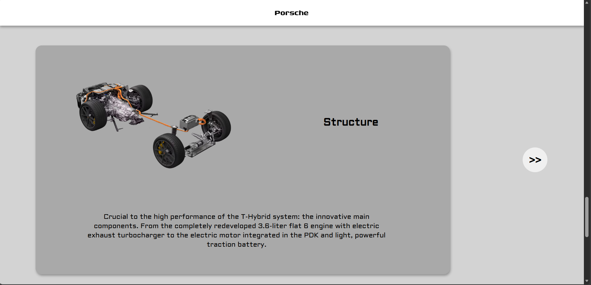

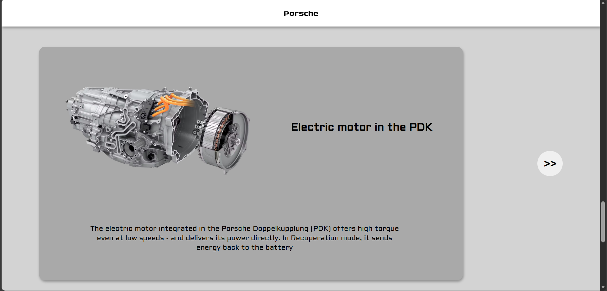

  
## Porsche 911 Spirit 70 (`spirit70.html`)
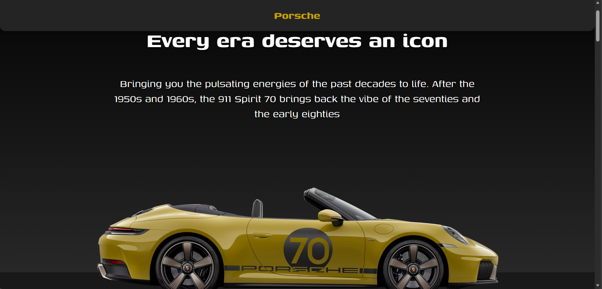

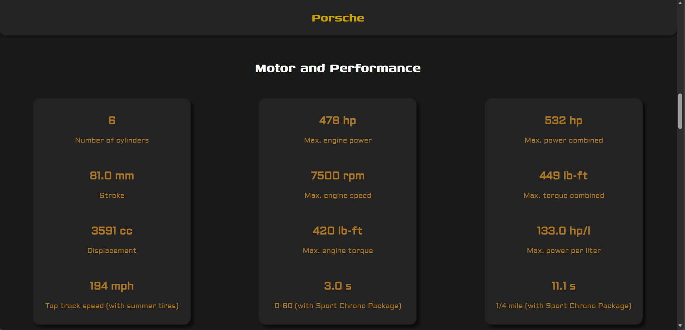

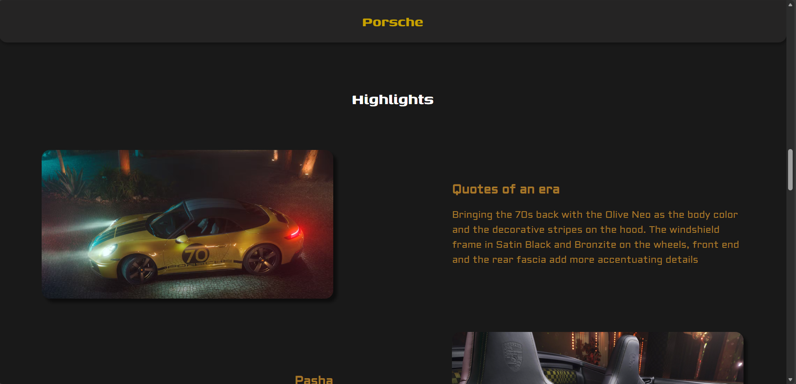

# Credits
- Porsche AG for model references  
- Official Porsche website: [https://www.porsche.com](https://www.porsche.com)

